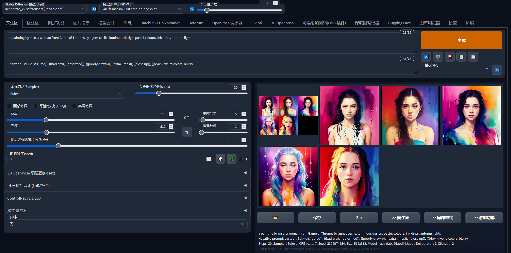

三行代码自动部署SD到谷歌colab。


## 用例
### Google Colab挂载网盘安装
点击下方按钮运行即可
[](https://colab.research.google.com/github/AI-skimos/3line-colab-sd/blob/master/all.ipynb)

### Google Colab不挂载网盘安装（每次需要重新下载模型文件）
拷贝以下代码到colab并运行
```
!bash <(curl -sL https://raw.githubusercontent.com/AI-skimos/3line-colab-sd/master/all.sh)
```

### 其他基于jupyter notebook的在线云服务
拷贝粘贴以下代码并运行
```
!curl -sL https://raw.githubusercontent.com/AI-skimos/3line-colab-sd/master/all.sh | bash -i /path/to/SD/folder
```

## 模板支持
可以通过在文本文件中列出模型、插件、脚本等的下载地址，来深度定制化一键部署的SD。
|命令行参数|用法|默认值|
|---|---|---|
|-f, --force-install|强制重新安装，可用于解决已有安装实例中的代码、文件损坏等问题|false （不强制重新安装）|
|-l, --template-location|模型文件地址。可以是一个github repo （比如：https://github.com/xxx/yyy），也可以是你的服务器本地的目录路径（比如：/tmp/template/example-template）。|https://github.com/AI-skimos/3line-colab-sd|
|-n, --template-name|模板的名称，即模板的目录名|camenduru|
|-i, --install-path|SD的安装路径|/content/drive/MyDrive/SD|

### 默认值安装
```
!bash <(curl -sL https://raw.githubusercontent.com/AI-skimos/3line-colab-sd/master/all.sh)
```
不指定模板地址及模板名称,默认安装本项目templates目录下的camenduru模板. (https://github.com/AI-skimos/3line-colab-sd/tree/master/templates/camenduru)

### 安装指定github repo的模板
你可以通过fork本项目,或者自己建立github项目来存储你的模板文件.
```
!bash <(curl -sL https://raw.githubusercontent.com/AI-skimos/3line-colab-sd/master/all.sh) -l https://github.com/xxx/yyy -n example-template
```
该命令会克隆https://github.com/xxx/yyy 项目并使用其中的example-template目录下的模板文件。

### 从Google Drive指定模板文件
当使用挂在GDrive安装方式时，可以指定一个谷歌云盘中的模板目录。
```
!bash <(curl -sL https://raw.githubusercontent.com/AI-skimos/3line-colab-sd/master/all.sh) -n vanwise -l /content/drive/MyDrive/template
```
该命令会去你的谷歌云盘（默认挂载点/content/drive/MyDrive)下的template目录中，使用vanwise目录下的模板文件。

### 模板文件支持列表
模板文本文件中，每行列出一个下载地址。这些下载地址可以是git repo，也可以是文件下载连接。除非下表特别说明，否则同一个文件中，两种地址可以混用。

根据自己的需要指定不同类别的模板，除了webui.txt外，其他文件都是可选。

|模板文件|内容|类型|例子|
|---|---|---|---|
|webui.txt|指定要安装的SD WebUI版本。 可选：在#后指定分支。注意：写多个webui，只有第一个会生效|必须是git repo地址|https://github.com/camenduru/stable-diffusion-webui#v2.1|
|extensions.txt|指定要安装的插件。|必须是git repo地址|https://github.com/dtlnor/stable-diffusion-webui-localization-zh_CN|
|scripts.txt|额外需要安装在scripts目录下的额外脚本文件。|均可|https://raw.githubusercontent.com/camenduru/stable-diffusion-webui-scripts/main/run_n_times.py|
|embeddings.txt|需要下载安装的embeddings。|均可|
|checkpoints.txt|需要下载安装的大模型。|均可|
|ESRGAN_models.txt|需要下载安装的放大算法。|均可|
|hypernetworks.txt|需要下载安装的超网。|均可|
|lora.txt|需要下载安装的lora。|均可|
|lycoris.txt|需要下载安装的lycoris。注意，如果需要配合lycoris插件只用。|均可|
|vae.txt|需要下载安装的vae。|均可|
|clip.txt|需要下载安装的clip。|均可|
|cn_models.txt|需要下载安装的controlnet模型。注意，需要配合controlnet插件使用|均可|

## 特性
* 挂载谷歌云盘安装(请确保你的云盘有足够空间)
* 全程安全下载, 避免网络及服务中断/错误造成的文件或repo损坏
* 一次成功后不需要重复安装, 再次运行会跳过安装步骤
* 安装脚本自动升级,无需手动更新安装代码
* 基于https://github.com/camenduru/stable-diffusion-webui-colab, 集成大量插件及客制化改动
* 绕开colab对SD的检查(避免警告)
* 支持自定义模板
